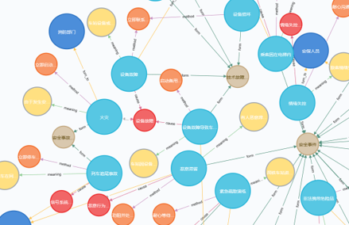
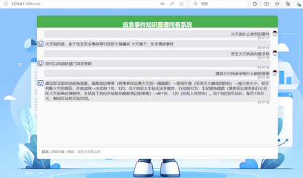

# QAsystem-knowledge-graph
# 基于知识图谱的应急事件处置问答系统

[](LICENSE)
[](https://www.python.org/)
[](https://flask.palletsprojects.com/)
[](https://neo4j.com/)

## 📖 项目简介

本项目针对人员密集场所（如车站、商场）中应急事件（火灾、列车故障、乘客突发疾病等）的快速处置需求，设计并实现了一套基于知识图谱的问答系统。系统通过构建应急事件知识图谱，结合自然语言问句分类与语义解析技术，帮助相关工作人员或普通用户快速获取准确、规范的应急处置措施，提高应急响应的效率和准确性。

## ✨ 功能特点

- **知识图谱构建**：从多源数据中抽取应急事件实体与关系，构建包含300+实体、400+关系的知识图谱，支持高效查询。
- **智能问句分类**：基于AC多模式匹配算法和自定义特征词典，对用户自然语言问题进行分类，识别实体与意图。
- **Cypher查询生成**：将分类结果转换为Neo4j的Cypher查询语句，精准检索答案。
- **轻量级Web界面**：基于Flask构建后端，提供简洁美观的前端交互，支持AJAX实时问答。
- **快速响应**：平均查询响应时间仅0.30秒，满足实时性需求。

## 🏗️ 系统架构

系统采用三层架构：

1. **知识图谱层**：使用Neo4j图数据库存储应急事件实体（事件类型、处置措施、相关资源等）及其关系。
2. **问答模型层**：包含问句分类、语义解析和答案抽取模块。通过AC算法匹配问句中的实体与特征词，转换为Cypher查询，从图谱中检索答案。
3. **用户交互层**：基于Flask的Web前端，提供问题输入、答案展示界面，通过AJAX与后端异步通信。

## 🛠️ 技术栈

| 类别 | 技术 |
|------|------|
| 后端框架 | Flask |
| 图数据库 | Neo4j |
| 前端 | HTML5, CSS3, JavaScript (AJAX) |
| 算法 | AC多模式匹配, 字典/模板匹配 |
| 开发语言 | Python 3.8+ |

## 🚀 快速开始

### 环境要求
- Python 3.8+
- Neo4j 4.x
- Git

### 安装与运行
#### 1.克隆仓库
  ```bash
  git clone https://github.com/artist1016/QAsystem-knowledge-graph.git
  cd QAsystem-knowledge-graph
  ```
#### 2. 安装Python依赖
  ```bash
  pip install -r requirements.txt
  ```
#### 3. 配置Neo4j
  启动本地Neo4j服务（默认端口7687）
  修改 config.py 中的Neo4j连接信息（用户名/密码） 
#### 4. 初始化知识图谱
  ```bash
  python build_graph.py   # 根据预处理数据构建图谱
  ```
#### 5. 启动Web服务
  ```bash
  python app.py
  ```
#### 6. 访问
  打开浏览器访问 http://127.0.0.1:5000

## 📁 项目结构
    QAsystem-knowledge-graph/
    ├── app.py                 # Flask应用主入口
    ├── build_graph.py         # 知识图谱构建脚本
    ├── config.py              # 配置文件
    ├── requirements.txt       # Python依赖
    ├── data/                  # 原始数据及预处理脚本
    │   └── emergency_data.csv
    ├── models/                # 问句分类与语义解析模块
    │   ├── classifier.py      # AC算法分类器
    │   └── query_builder.py   # Cypher查询生成
    ├── static/                # 前端静态文件 (CSS, JS)
    ├── templates/             # HTML模板
    │   └── index.html
    └── README.md

## 🖼️ 演示效果




示例：  
用户输入：“发生火灾怎么办？”  
系统输出：“立即报警，使用灭火器扑救初期火灾，组织人员疏散……”  


## 📈 性能指标
  知识图谱规模：300+实体，400+关系  
  平均查询响应：0.30秒  
  代码总量：1201行（Python 630行，前端 571行）  

## 🔮 后续展望
  图谱扩展：接入更多专业应急数据库，丰富实体与关系  
  多模态支持：增加图像识别、语音输入等交互方式  
  语义增强：引入预训练模型提升复杂问句的理解能力  
  高并发优化：使用异步框架（如FastAPI）提高吞吐量  

## 👨‍💻 作者
 Dai Yi - BJTU   
 邮箱：1137251662@qq.com  
 GitHub：artist1016  
